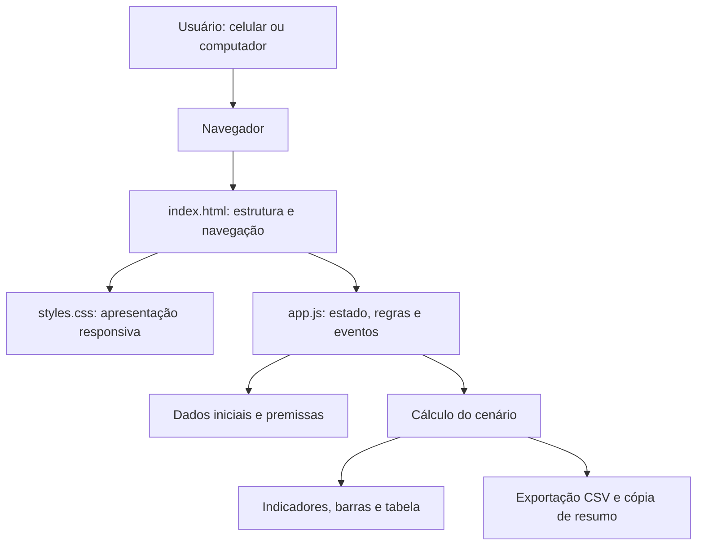
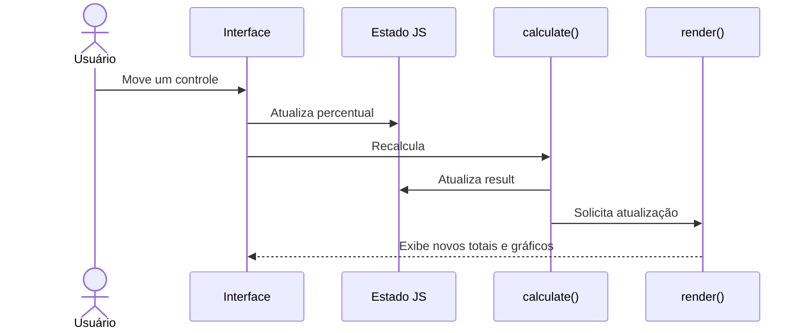

# Arquitetura — Simulador Eleitoral 2026

> **Status:** versão inicial (site estático), em repositório privado.  
> **Objetivo:** documentar a arquitetura efetivamente implementada e a evolução planejada.  
> **Importante:** o simulador trabalha com hipóteses configuráveis; **não** é pesquisa eleitoral ou previsão.

## 1. Visão geral

O projeto é uma aplicação web **client-side**, desenvolvida com **HTML5, CSS3 e JavaScript puro (vanilla JS)**. Não utiliza framework de interface, bundler, banco de dados, API própria ou servidor de aplicação.

O navegador carrega os arquivos estáticos, mantém os parâmetros da simulação em memória, recalcula os totais e atualiza os elementos da interface. Os cálculos são locais: nenhuma solicitação a um backend é necessária para simular cenários.



## 2. Estrutura do repositório

```text
simulador-eleitoral-2026/
├── index.html      # Interface, abas, cartões, tabelas e pontos de montagem
├── styles.css      # Tema escuro, componentes visuais e regras responsivas
├── app.js          # Estado, controles, renderização e exportação
├── model.js        # Dados iniciais e cálculo independente da interface
├── assets/         # Fotos locais dos candidatos
├── tests/          # Verificações do cálculo
├── docs/           # Arquitetura e roadmap
├── README.md       # Apresentação e instruções básicas
└── .nojekyll       # Compatibilidade com futura publicação estática
```

### Responsabilidades

| Arquivo | Responsabilidade |
|---|---|
| `index.html` | Estrutura semântica, áreas de resultado, navegação por abas e carregamento do CSS/JS |
| `styles.css` | Estilos, cores, grades, barras e adaptações para telas menores |
| `app.js` | Estado da interface, controles, renderização, eventos, CSV e cópia |
| `model.js` | Dados iniciais, distribuição dos votos e cálculo independente da interface |
| `assets/` | Fotos locais de Lula e Flávio, com créditos na aba Fontes |
| `tests/model.test.cjs` | Conservação dos votos, arredondamento e cenários extremos |
| `README.md` | Instruções gerais e advertências sobre os dados |
| `.nojekyll` | Evita processamento Jekyll em uma eventual hospedagem no GitHub Pages |

## 3. Organização lógica do JavaScript

A implementação divide o modelo de cálculo (`model.js`) e a interface (`app.js`), com as seguintes unidades lógicas:

1. **Dados iniciais:** `defaults` contém grupos de votos transferíveis e percentuais iniciais; `first` contém os votos dos dois candidatos e a abstenção original.
2. **Estado em memória:** `entries` guarda as distribuições por grupo; `turnout` guarda a taxa de retorno dos ausentes e a distribuição desses votos; `result` guarda o último resultado calculado.
3. **Controles:** `buildControls()` e `buildTurnout()` constroem os sliders.
4. **Cálculo:** `calculate()` aplica as hipóteses e consolida votos válidos, abstenções e inválidos.
5. **Renderização:** `render()` atualiza totais, percentuais, barras, comparação histórica e tabela.
6. **Eventos:** ouvintes de `input` e `click` atualizam estado, recalculam, trocam abas, restauram valores e exportam.

### Fluxo de interação



## 4. Modelo de cálculo

Para cada grupo transferível com `V` votos:

- Calcular as quotas exatas de Lula, Flávio e restante.
- Distribuir inicialmente a parte inteira de cada quota.
- Distribuir os votos que faltam pelas maiores partes fracionárias.
- Em empate de frações, usar a ordem Lula, Flávio e restante.
- Garantir `L + F + R = V` e valores inteiros não negativos.

Os percentuais de Lula e Flávio não podem ultrapassar **100% somados**.

O destino de `R` depende da natureza do grupo:

- **Votos de outros candidatos:** a parcela restante é tratada como **abstenção hipotética** no segundo turno.
- **Brancos e nulos:** a parcela restante permanece como **voto inválido**.

O módulo de comparecimento usa a abstenção **original** como base para o retorno, evitando reaplicar o percentual aos novos abstencionistas gerados pelas transferências:

- `retornantes = arredondar(abstencoes_originais × taxa_retorno / 100)`
- Os retornantes são distribuídos entre Lula, Flávio e votos inválidos.
- A quantidade de retornantes é subtraída do total de abstenções.

**Indicadores exibidos:**

- Votos simulados de cada candidato;
- Participação percentual sobre os **votos válidos**;
- Diferença absoluta de votos e diferença em pontos percentuais;
- Abstenções e votos inválidos;
- Comparação visual com os números de 2022;
- Memória de cálculo por origem.

### Limitações metodológicas

O modelo é **determinístico**, não probabilístico. Ele não calcula intervalos de confiança, margem de erro, correlações, probabilidades de vitória ou comportamento individual dos eleitores. As hipóteses configuradas não possuem validação estatística automática.

Os valores de entrada precisam ser conferidos contra dados oficiais antes de qualquer publicação. A comparação de 2022 é apenas referência histórica; não constitui projeção automática de tendência.

## 5. Interface e responsividade

O resultado simulado do segundo turno permanece acima das abas, com foto do eleito no cenário (ou indicação de empate). A interface é organizada em seis abas:

| Aba | Função |
|---|---|
| Visão geral | Composição por candidato, percentuais recebidos por origem e indicadores |
| Transferências | Percentuais por candidato de origem |
| Abstenções, nulos e brancos | Retorno dos ausentes, distribuição e transferência dos votos inválidos |
| Comparação com 2022 | Resultado histórico oficial e cenário atual |
| Detalhamento | Votos e percentuais por origem, exportação CSV e cópia do resumo |
| Fontes dos dados | Referências TSE, estado de verificação das entradas e créditos das fotos |

O CSS usa **Grid** e **Flexbox**, com ajuste para telas pequenas. A responsividade existe na versão inicial, mas ainda deve ser validada em navegadores móveis e desktops reais.

## 6. Persistência e privacidade

**Estado atual:**

- Os ajustes permanecem apenas em memória durante a sessão.
- Ao recarregar a página, os valores retornam aos padrões.
- Não existe autenticação, conta de usuário, armazenamento remoto, cookies próprios de rastreamento ou banco de dados.
- A exportação CSV usa `Blob` e `URL.createObjectURL()`; o arquivo é gerado localmente.
- A função de cópia utiliza a API `navigator.clipboard` quando disponível.

## 7. Execução local e testes

Não há etapa de compilação. O teste de cálculo pode ser executado com `node tests/model.test.cjs`. A interface foi inspecionada no Chrome em desktop e em emulação de celular (440 × 956). Foram verificados os seis painéis, retorno integral, mudança de vencedor/foto, restauração e download do CSV. Ainda é necessário testar em dispositivos reais e outros navegadores.

### Computador

```bash
git clone https://github.com/brauliofreire/simulador-eleitoral-2026.git
cd simulador-eleitoral-2026
python3 -m http.server 8000
```

Abra `http://localhost:8000` no navegador. O clone de repositório privado exige autenticação no GitHub.

### GitHub Codespaces

No repositório: **Code → Codespaces → Create codespace on main**. No terminal, execute:

```bash
python3 -m http.server 8000
```

Na aba **Ports**, abra a porta 8000 no navegador. **Mantenha a porta privada** para não expor a prévia.

### Roteiro mínimo de testes manuais

- [ ] Abrir as quatro abas sem erros no console.
- [ ] Alterar cada grupo e verificar atualização imediata.
- [ ] Confirmar que `Lula + Flávio ≤ 100%` em cada grupo.
- [ ] Verificar que votos de origem são conservados em cada distribuição.
- [ ] Testar taxa de retorno de ausentes em 0%, 50% e 100%.
- [ ] Restaurar os parâmetros e comparar com o cenário inicial.
- [ ] Exportar CSV e conferir totais.
- [ ] Copiar o resumo (em contexto seguro/HTTPS).
- [ ] Testar em telas pequenas, orientação vertical e horizontal.
- [ ] Conferir todos os dados eleitorais e rótulos contra fontes oficiais.

## 8. Implantação e segurança

**Situação atual:** o código está em repositório **privado** e o site **não foi publicado**.

Para publicação futura, a aplicação pode ser hospedada em serviços de arquivos estáticos (como GitHub Pages), após validação dos dados e aprovação do proprietário.

**Atenção:** não confundir visibilidade do repositório com visibilidade do site publicado. Dependendo da plataforma e do plano, a hospedagem pode ser pública mesmo quando o código-fonte está privado. Verificar as configurações antes de habilitar qualquer publicação.

## 9. Evolução proposta: PWA

**Ainda não implementada.** Para instalação em dispositivos e operação offline, adicionar:

```text
manifest.webmanifest   # Nome, ícones, cores e modo standalone
sw.js                  # Cache e estratégia offline
icons/                 # Ícones de instalação em vários tamanhos
```

Também são propostas futuras:

- Persistência de cenários em `localStorage`;
- Links compartilháveis que codifiquem os parâmetros do cenário;
- Melhorias de acessibilidade e testes automatizados;
- Ampliação da modularização de dados, cálculo e apresentação (o cálculo já está separado em `model.js`);
- Versionamento explícito e referências verificáveis dos dados eleitorais.

### Critérios de aceite da PWA

- [ ] Instalação em Android e em desktop compatível.
- [ ] Adição à tela inicial no iOS conforme recursos do Safari.
- [ ] Interface utilizável offline após a primeira visita.
- [ ] Atualizações de arquivos estáticos sem cache obsoleto.
- [ ] Recuperação de cenários salvos localmente.
- [ ] Testes de instalação e responsividade.

## 10. Decisões arquiteturais

| Decisão | Justificativa | Consequência |
|---|---|---|
| Site estático | Simplicidade, custo baixo e portabilidade | Não há persistência entre dispositivos |
| JavaScript puro | Sem dependências ou build | A modularização se torna desejável com o crescimento |
| Cálculo no navegador | Resposta imediata e sem infraestrutura | Lógica e dados ficam acessíveis ao usuário |
| Dados iniciais locais | Permite execução offline futura | Atualização dos dados exige revisão do código |
| Repositório privado inicialmente | Revisão antes da divulgação | Prévia requer acesso autorizado |
| PWA como evolução | Uma base para celular e computador | Exige manifest, service worker e testes |

---

**Próximo marco recomendado:** validar a implementação atual e os dados de entrada, corrigir eventuais inconsistências e, depois, implementar a PWA em uma etapa separada, mantendo o repositório privado até autorização de publicação.
