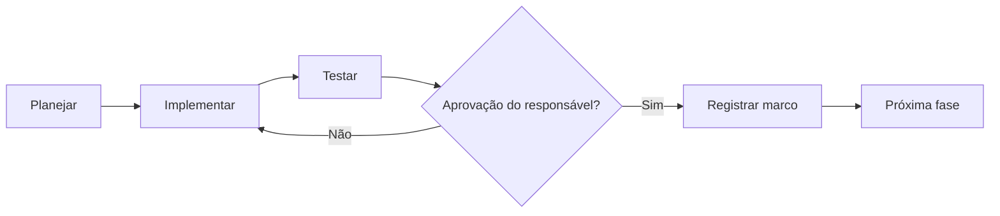

# ROADMAP — Simulador Eleitoral 2026

> **Versão:** 1.0 — 08/10/2026  
> **Status:** planejamento inicial, sujeito a revisão após os primeiros testes.  
> **Repositório:** privado (`brauliofreire/simulador-eleitoral-2026`).  
> **Princípio:** simulação de cenários hipotéticos, **não** pesquisa eleitoral, previsão ou recomendação de voto.

## 1. Objetivo do produto

Disponibilizar um simulador eleitoral transparente, intuitivo e responsivo para explorar cenários de transferência de votos e comparecimento, acessível em celular e computador e, futuramente, instalável como Progressive Web App (PWA).

### Princípios de implementação

- **Mobile-first:** interface confortável em telas pequenas sem prejudicar o desktop.
- **Privacidade:** processamento local, sem coleta de dados pessoais.
- **Transparência:** premissas, fontes, metodologia e limites visíveis.
- **Baixa complexidade:** manter HTML/CSS/JavaScript puro enquanto atender ao produto.
- **Evolução incremental:** cada fase deve ser testada e aprovada antes da próxima.
- **Sem publicação automática:** manter repositório privado e não ativar hospedagem pública sem aprovação explícita.

## 2. Visão consolidada

| Fase | Nome | Prioridade | Dependência | Estado |
|---|---|---|---|---|
| 0 | Base funcional | — | — | **Implementada; não homologada** |
| 1 | Validação e correções | P0 | Fase 0 | Pendente |
| 2 | Qualidade e experiência responsiva | P0 | Fase 1 | Pendente |
| 3 | PWA e instalação | P1 | Fase 2 | Pendente |
| 4 | Persistência e compartilhamento | P1 | Fase 3 (recomendado) | Pendente |
| 5 | Transparência dos dados e documentação pública | P0 para publicação | Fases 1–4 | Pendente |
| 6 | Publicação controlada | P1 | Fase 5 + aprovação | Bloqueada por aprovação |
| 7 | Evoluções opcionais | P2 | Fase 6 | Backlog |

**P0:** essencial para confiabilidade ou publicação; **P1:** funcionalidade prioritária; **P2:** melhoria opcional.

Não há estimativas de prazo fechadas neste documento. Os marcos dependem dos resultados dos testes e de decisões do responsável.

---

## 3. Fase 0 — Base funcional

**Estado:** implementada no repositório; ainda não homologada em navegador.

### Escopo já presente

- [x] Interface web estática (`index.html`, `styles.css`, `app.js`).
- [x] Visão geral com votos, percentuais e diferença.
- [x] Controles de transferência por grupos de votos.
- [x] Simulação de retorno de eleitores originalmente ausentes.
- [x] Comparação visual com dados de 2022.
- [x] Tabela de memória de cálculo.
- [x] Exportação de CSV e cópia de resumo.
- [x] Repositório privado e documentação arquitetural.

### Pendências conhecidas

- [ ] Testar a execução real em desktop e celular.
- [ ] Verificar os dados eleitorais usados como entradas e suas fontes.
- [ ] Validar coerência metodológica das hipóteses.
- [ ] Corrigir defeitos identificados nos testes.

**Marco M0:** primeira execução revisada pelo responsável.

---

## 4. Fase 1 — Validação e correções (P0)

**Objetivo:** garantir que os cálculos e dados apresentados sejam confiáveis e claramente identificados.

### Entregáveis

- [ ] Auditar valores iniciais, nomes, cargos, datas e resultados eleitorais contra fontes oficiais (preferencialmente TSE).
- [ ] Distinguir claramente **dados oficiais**, **premissas configuráveis** e **resultados simulados**.
- [ ] Confirmar o tratamento de votos válidos, brancos, nulos, abstenções e transferências.
- [ ] Definir a interpretação dos percentuais de transferência e a regra para a parcela não distribuída.
- [ ] Verificar conservação dos votos e regras de arredondamento.
- [ ] Verificar os limites dos sliders e os casos extremos (0%, 100%, empate, retorno integral).
- [ ] Revisar nomenclatura e avisos para evitar aparência de previsão científica sem fundamento.
- [ ] Registrar defeitos e decisões metodológicas.

### Critérios de aceite

1. Todos os números apresentados como factuais têm fonte identificável.
2. As fórmulas e seus resultados podem ser reproduzidos manualmente.
3. Nenhum ajuste gera percentuais negativos, acima de 100% ou contagens incoerentes.
4. O responsável executa e aprova o roteiro de testes.

**Marco M1 — Aprovação:** metodologia e base de dados validadas.

---

## 5. Fase 2 — Qualidade e responsividade (P0)

**Objetivo:** tornar a versão web confortável, acessível e estável em celular e computador.

### Entregáveis

- [ ] Testar Chrome, Firefox, Safari e Edge conforme disponibilidade.
- [ ] Testar Android, iOS e desktop, incluindo orientação vertical/horizontal.
- [ ] Melhorar o tamanho e espaçamento dos controles de toque.
- [ ] Evitar rolagem horizontal indevida e sobreposição de textos.
- [ ] Aprimorar semântica HTML, rótulos, foco de teclado e contraste.
- [ ] Adicionar testes automatizados para a função de cálculo.
- [ ] Criar testes de regressão para cenários conhecidos.
- [ ] Documentar como executar testes localmente e no Codespaces.
- [ ] Revisar exportação CSV, codificação e compatibilidade com planilhas.

### Critérios de aceite

1. Navegação e sliders utilizáveis em telas móveis.
2. Cálculos críticos cobertos por testes reproduzíveis.
3. Sem erros de console nos fluxos principais.
4. Exportação CSV validada.
5. Aprovação manual em pelo menos um celular e um computador.

**Marco M2 — Aprovação:** versão web responsiva homologada.

---

## 6. Fase 3 — PWA e instalação (P1)

**Objetivo:** permitir instalação em dispositivos compatíveis e funcionamento offline.

### Entregáveis

- [ ] Criar `manifest.webmanifest` com nome, descrição, cores e modo `standalone`.
- [ ] Criar ícones adequados (incluindo 192×192 e 512×512).
- [ ] Adicionar `sw.js` com estratégia de cache para recursos estáticos.
- [ ] Definir estratégia de atualização e invalidação do cache.
- [ ] Preparar metadados para experiência de instalação em Android e desktop.
- [ ] Documentar o fluxo de **Adicionar à Tela de Início** no iOS.
- [ ] Testar inicialização offline após primeiro carregamento.
- [ ] Validar comportamento em HTTPS, requisito para service workers em produção (com exceções de desenvolvimento, como localhost).

### Critérios de aceite

1. A aplicação pode ser instalada nos navegadores/sistemas compatíveis.
2. Abre em modo de aplicativo quando suportado.
3. Continua funcionando offline após os recursos terem sido armazenados.
4. Recebe atualizações sem permanecer presa a versões obsoletas.
5. O proprietário aprova a experiência de instalação.

**Marco M3 — Aprovação:** PWA instalável homologada.

> **Nota:** instalação e comportamento variam entre sistemas operacionais e navegadores. A versão PWA ainda não existe na implementação atual.

---

## 7. Fase 4 — Persistência e compartilhamento (P1)

**Objetivo:** evitar perda de configurações e permitir reprodução de cenários.

### Entregáveis

- [ ] Persistir parâmetros em `localStorage` com versão de esquema.
- [ ] Disponibilizar ações **Salvar cenário**, **Carregar cenário** e **Restaurar padrões**.
- [ ] Permitir nomear cenários locais, se a experiência justificar.
- [ ] Gerar URL compartilhável com os parâmetros (query string ou fragmento).
- [ ] Validar e normalizar parâmetros recebidos por URL.
- [ ] Disponibilizar ação **Copiar link do cenário**.
- [ ] Tratar cenários antigos após mudanças no modelo de dados.
- [ ] Informar que o armazenamento local não sincroniza automaticamente entre dispositivos.

### Critérios de aceite

1. Configurações salvas sobrevivem ao recarregamento.
2. Um link reproduz os mesmos percentuais em outro navegador.
3. Parâmetros inválidos não quebram o aplicativo.
4. Restaurar padrões funciona sem ambiguidades.
5. Nenhum servidor recebe os dados da simulação para executar o cálculo.

**Marco M4 — Aprovação:** cenários persistentes e compartilháveis.

---

## 8. Fase 5 — Transparência e preparação pública (P0)

**Objetivo:** garantir clareza sobre os dados, limites e funcionamento do simulador antes da divulgação.

### Entregáveis

- [ ] Incluir fontes e datas de referência para todos os dados factuais.
- [ ] Documentar fórmulas, regras de transferência e arredondamento.
- [ ] Explicar a diferença entre cenário hipotético e projeção estatística.
- [ ] Identificar quais entradas são editáveis e quais são referências fixas.
- [ ] Exibir aviso visível de que a ferramenta **não é pesquisa nem previsão eleitoral**.
- [ ] Revisar textos para neutralidade e evitar interpretação de endosso político.
- [ ] Revisar acessibilidade, privacidade e segurança.
- [ ] Revisar `README.md`, `docs/ARQUITETURA.md` e este roadmap.
- [ ] Preparar checklist de lançamento e rollback.

### Critérios de aceite

1. Dados factuais auditados e referenciados.
2. Limitações metodológicas compreensíveis ao público.
3. Interface revisada quanto a clareza e neutralidade.
4. Aprovação explícita do responsável para iniciar a publicação.

**Marco M5 — Aprovação:** produto pronto para decisão de lançamento.

---

## 9. Fase 6 — Publicação controlada (P1)

**Objetivo:** disponibilizar a aplicação por HTTPS sem comprometer o controle de publicação.

### Entregáveis

- [ ] Escolher hospedagem estática e domínio/URL.
- [ ] Confirmar as regras de visibilidade da hospedagem escolhida.
- [ ] Verificar se a hospedagem é compatível com repositório privado no plano utilizado.
- [ ] Configurar HTTPS e caminhos corretos dos recursos.
- [ ] Publicar apenas após autorização explícita.
- [ ] Realizar testes pós-publicação no celular e no computador.
- [ ] Validar instalação PWA e funcionamento offline na URL definitiva.
- [ ] Documentar atualização, reversão e desativação da hospedagem.

### Critérios de aceite

1. Autorização de publicação registrada.
2. URL funcional e HTTPS válido.
3. Fluxos críticos homologados na versão hospedada.
4. Procedimento de rollback documentado.

**Marco M6:** lançamento aprovado e validado.

> **Restrição:** não ativar GitHub Pages, não abrir o repositório e não publicar a aplicação sem autorização expressa. Repositório privado não significa necessariamente site privado.

---

## 10. Fase 7 — Backlog opcional (P2)

Itens a avaliar somente após estabilização da versão inicial:

- [ ] Biblioteca de cenários predefinidos e comparações lado a lado.
- [ ] Gráficos mais detalhados por origem de votos.
- [ ] Histórico de cenários locais.
- [ ] Importação/exportação de parâmetros em JSON.
- [ ] Melhorias de impressão e exportação de relatório.
- [ ] Internacionalização, se houver demanda.
- [ ] Modularização do JavaScript para facilitar manutenção.
- [ ] Automação de CI para testes e validações.
- [ ] Monitoramento de erros **somente mediante avaliação de privacidade e consentimento**, se necessário.

---

## 11. Governança e fluxo de aprovação

Cada fase segue o ciclo:

### Evidências recomendadas

- Commits e pull requests associados à fase;
- Checklist de testes executados;
- Capturas de tela ou gravações em celular/desktop, quando útil;
- Registro de problemas e correções;
- Aprovação explícita do responsável para cada marco;
- Referências verificáveis para dados eleitorais.

## 12. Próxima ação

**Iniciar a Fase 1**, testando o simulador atual no GitHub Codespaces ou localmente e conferindo a metodologia e os dados iniciais. Não iniciar publicação pública nem implementação PWA antes de registrar o resultado dessa validação.

---

*Documento vivo: atualizar estados, decisões e critérios conforme o projeto evoluir.*
